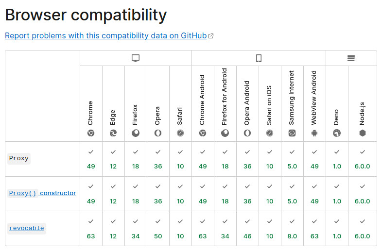

# Array-router  

Array-route is a simple, light-weight library that helps you manage routes in your React application. It's designed for React 18 and above.


## Installation

```sh
npm install --save-dev array-router
```

## Syntax

App.js
```js
import { useRouter } from 'array-router';
/* ... */
export default function App() {
  const provide = useRouter();
  return (
    <div className="App">
      {provide((parts, query, { throw404 }) => {
        try {
          switch (parts[0]) {
            case undefined:
              return <WelcomePage />
            case 'categories':
              return <CategoryPage />
            case 'forums':
              return <ForumPage />
            default:
              throw404();
          }
        } catch (err) {
          return <ErrorPage error={err} />
        }
      })}
    </div>
  );
}
```

CategoryPage.js
```js
export default function CategoryPage() {
  const [ parts, query ] = useRoute();
  const categoryId = parts[1];
  return (
    /* ... */
  );
}
```

## Basic design

Array-router does not actually provide any routing logic. Instead, it gives you an `Array` containing
`pathname.split('/')` and an `Object` containing values from `searchParams`. You can then use them to build out
a routing scheme that suits the needs of your app.

The aforementioned array and object are
<a href="https://developer.mozilla.org/en-US/docs/Web/JavaScript/Reference/Global_Objects/Proxy">JavaScript proxy
objects</a>. Array-router tracks all actions you perform on them and takes appropriate actions based on this
information. In the above example, Array-router knows that `App` reads the first item when it renders while
`CategoryPage` reads the second. If the location changes from `/categories/1` to `/categories/2`, Array-router will
ask `CategoryPage` to rerender but not `App` since only `parts[1]` is different.

Mutation of `parts` or `query` will cause the location to change. For instance, `parts.push('product', 17)` would move
you from `/categories/1` to `/categories/1/product/17`. Conversely, `parts.pop()` would send you from `/categories/1`
to `/categories` while `parts.splice(0)` would send you all the way back to the root level.

## Override default push vs. replace behavior

By default, changes to `parts` trigger calls to
[`history.pushState`](https://developer.mozilla.org/en-US/docs/Web/API/History/pushState) while changes to `query` 
trigger calls to [`history.replaceState`](https://developer.mozilla.org/en-US/docs/Web/API/History/replaceState). 
When both type of changes occur, `pushState` has precedence.

You can use [`replacing`](./doc/replacing.md) to indicate that changes to the path should trigger a `replaceState`
instead of the default `pushState`:

```js
  replacing(() => {
    parts[0] = 'categories';
    parts[1] = 17;
  });
```

Conversely, you can use [`pushing`](./doc/pushing.md) to force the use of `pushState` when query variables are changes:

```js
  pushing(() => query.search = evt.target.value);
```

## Changing route during rendering

Normally, you would change `parts` or `query` inside event handlers. You can make changes while a component is 
rendering--if you must. To do so, you need to use [`replacing`](./doc/replacing.md):

```js
function ProjectPage() {
  const [ parts, query, { replacing } ] = useRoute();
  if (parts[1] === 'summary') {
    // fix an outdated URL
    replacing(() => parts[1] = 'overview');
  }
  /* ... */
}
```

`replacing` will throw a [`RouteChangeInterruption`](./doc/RouteChangeInterruption.md) error. When the router
receives this error from its error boundary, the changes will get applied. The error boundary's subsequent 
attempt at reconstructing the component tree should then proceed without incident.

This behavior is applicable to consumers of `useRoute` only. At the root level, changes get applied immediately.

## Error handling

Array-router provides an [error boundary](https://reactjs.org/docs/error-boundaries.html) that redirect
errors to the root-level component (i.e. the one that calls `useRouter`). A captured error is rethrown the 
moment your code attempts to access one of the proxies (`parts` or `query`) or when [`rethrow`](./doc/rethrow.md) 
is called.

## Array proxy

Working with array elements is somewhat unintuitive. `parts[0]`, `parts[1]` don't tell us what they actually 
represent. This is why the library provides a way for you to reference array elements by name instead:

```js
  const route = arrayProxy(parts, {
    screen: 0,
    id: 1,
  });
  if (route.screen === 'products') {
    if (route.id) {
      return <ProductPage id={route.id} />;
    } else {
      return <ProductList />;
    }
  } else ...
```

`route.screen` in the example is mapped to `parts[0]` while `route.id` is mapped `parts[1]`. The mapping works for
both reading and writing. It works for deleting too: `delete route.screen;` is translated as `parts.splice(0)`
(since removal of both the zeroth element and those coming after is the only way we can ensure that `parts[0]`
would yield `undefined`).

See the documentation of [arrayProxy](./doc/arrayProxy.md) for more sophisticated ways of mapping elements to
properties.

## Usage in non-web environment

This library can be employed in a non-web environment. You need to provide the following functions for 
handling URLs in the router options:

* [`parseURL`](./parseURL.md)
* [`createURL`](./createURL.md)
* [`applyURL`](./applyURL.md) <sup>optional</sup>

## API Reference

### Hooks

* [`useLocation`](./doc/useLocation.md)
* [`useRouter`](./doc/useRouter.md)
* [`useRoute`](./doc/useRoute.md)
* [`useSequentialRouter`](./doc/useSequentialRouter.md)

### Router methods

* [`detour`](./doc/detour.md)
* [`isDetour`](./doc/isDetour.md)
* [`pushing`](./doc/pushing.md)
* [`replacing`](./doc/replacing.md)
* [`rethrow`](./doc/rethrow.md)
* [`throw404`](./doc/throw404.md)
* [`trap`](./doc/trap.md)

### Error objects

* [`RouteChangeInterruption`](./doc/RouteChangeInterruption.md)
* [`RouteChangePending`](./doc/RouteChangePending.md)
* [`RouteError`](./doc/RouteError.md)

## Compatibility

Array-router makes use of
[JavaScript proxy](https://developer.mozilla.org/en-US/docs/Web/JavaScript/Reference/Global_Objects/Proxy). According
to Mozilla, it is available in the following environment:



Since the functionality in question cannot be polyfilled, Array-router does not work in any version of Internet Explorer
or Opera Mini.
